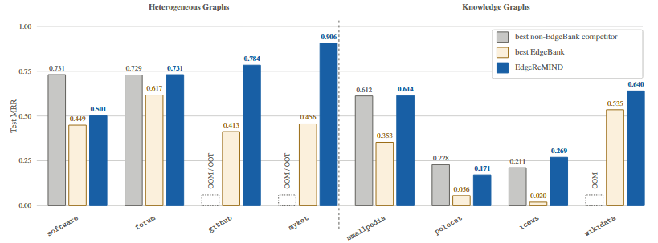
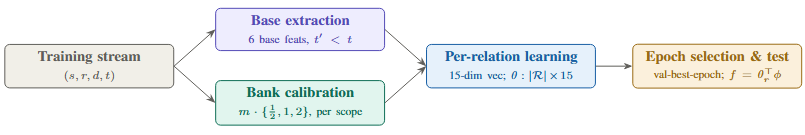
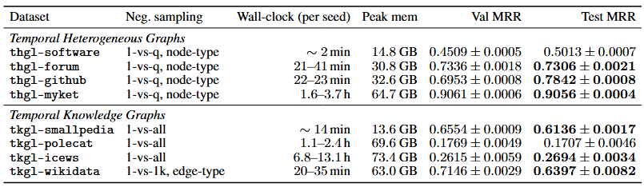
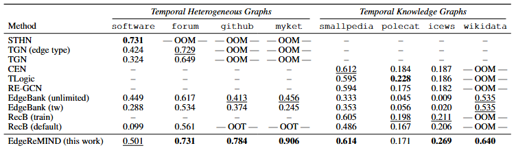

<a id="readme-top"></a>

<div align="center">

# EdgeReMIND

<h3 style="font-size: 22px">A Scalable, Top-Ranked Memorization Baseline for Temporal Multi-Relational Link Prediction</h3>

<br/>



<br/>

<p align="center"><em>Test MRR on the TGB&nbsp;2.0 leaderboard. EdgeReMIND (blue) is the only relation-aware method that runs on all eight datasets, and sets the highest reported test MRR on six of them &mdash; entirely on CPU. OOM means out of memory; OOT means out of time.</em></p>

</div>

## About The Project

**EdgeReMIND** is a CPU-only, embedding-free baseline for temporal multi-relational link prediction. Instead of learning node or edge representations, it scores each candidate destination with a small per-relation linear model over 15 hand-designed memorization features: six base features (occurrence counts and bounded-recency signals at three memorization scopes) and a nine-column _multi-timescale bank_ whose decay rates are calibrated, unit-free, from each dataset's own inter-recurrence gaps.

The result is a model that fits at most a `|R| × 15` weight matrix &mdash; fewer than 18k parameters even on a knowledge graph of nearly 10M temporal facts &mdash; and yet reaches or exceeds the accuracy of representation-learning methods on the [TGB 2.0](https://tgb.complexdatalab.com/) benchmark.

### Highlights

- **Top-ranked, CPU-only**: sets state-of-the-art test MRR on six of eight TGB&nbsp;2.0 datasets — including all three largest graphs by node count (`github`, `myket`, `wikidata`) and two head-to-head overtakes of embedding methods — running entirely on CPU with no GPU and no embeddings.
- **Runs where others can't**: the only relation-aware method that runs on all eight datasets, including the three largest graphs where embedding methods exhaust memory.
- **Tiny parameter budget**: one 15-dimensional weight vector per relation type and nothing else; the footprint grows only with the number of relation types, not with nodes, edges, or timestamps.
- **Data-calibrated, no per-dataset tuning**: the multi-timescale bank's decay rates are calibrated automatically from each dataset's gap distribution; the two hand-set constants (γ = 2, n = 3) are held fixed across all eight datasets.
- **Per-relation specialization**: a separate 15-dimensional linear model per relation type is the primary driver of accuracy — this is what lifts a memorization baseline to the embedding-method ceiling.

## Installation

> [!NOTE]
> This repository is a copy of the [TGM library](https://github.com/tgm-team/tgm) with EdgeReMIND added to it, so it is self-contained: installing it installs TGM together with the EdgeReMIND method and examples. TGM is included under its original license (see [License & Attribution](#license--attribution)). EdgeReMIND is intended for upstream contribution to TGM after peer review and publication.

### Requirements

**Reference environment (used for all reported numbers):** **Python 3.11.9**, **Linux (x86-64)**, PyTorch `2.5.1`. EdgeReMIND runs entirely on CPU — it uses no GPU operations regardless of the installed torch build (the locked environment resolves to a CUDA-enabled build on Linux, which EdgeReMIND simply never exercises).

**Recommended hardware for full-scale runs:** a single node with **~64 CPU cores** and up to **~128 GB RAM**. The core count matches the paper's reported wall-clock times — fewer cores work and give identical MRR, just proportionally slower — and 128 GB comfortably covers the most memory-intensive datasets (`tkgl-icews`, `tkgl-polecat`, ~73 GB peak). Memory need is a per-dataset property, not a function of core count: the smaller datasets require far less (the smallest, `thgl-software`, runs under 16 GB), so a laptop is fine for verifying the install and running the small graphs.

**Portability.** EdgeReMIND is pure-CPU Python built on [TGM](https://github.com/tgm-team/tgm), so it runs anywhere TGM does. It has been tested on Linux (the reference environment), macOS, and Windows. For a fixed configuration (seed, worker count, and software environment) the results are exactly reproducible; across different environments (PyTorch version, OS, or CPU/GPU build), count-dominated datasets still reproduce exactly, while the most numerically sensitive datasets may differ by up to ~0.01 MRR due to floating-point accumulation order. The reported numbers correspond to the reference environment (Linux, `uv`, torch `2.5.1`). The smallest dataset (`thgl-software`) runs on any modern machine in a couple of minutes on a many-core node, though wall-clock time is proportionally longer on a few-core laptop (the MRR is unaffected).

Key dependencies:

- PyTorch `2.5.1`
- NumPy `2.4.6`
- py-tgb `2.2.0` (pin this exactly — the data pipeline depends on it, and TGB's dataset/API versions shift across releases)
- torch-geometric `2.7.0`
- SciPy `1.17.1`, scikit-learn `1.9.0`, pandas `3.0.3`

Exact versions are pinned in `pyproject.toml` and locked in `uv.lock`, so `uv sync` (below) installs the locked environment (PyTorch `2.5.1`). EdgeReMIND is deterministic for a fixed configuration: repeated runs with the same seed, worker count, and environment reproduce the reported MRRs exactly. The TGM library is included with this repository.

#### From Source (recommended)

> [!NOTE]
> During double-blind review this repository is hosted as an anonymized mirror. Download the repository as a ZIP from the anonymous link (`https://anonymous.4open.science/r/EdgeReMIND-31B1/`), unpack it, and install from the unpacked directory using either option below:

```sh
unzip EdgeReMIND-*.zip
cd EdgeReMIND-*/
```

**Option 1 — `uv` (recommended for exact reproduction).** This project ships a `uv.lock`, so [`uv`](https://docs.astral.sh/uv/) installs the exact locked dependency versions for a deterministic environment (this is how TGM is built). Install `uv` if you don't have it (`curl -LsSf https://astral.sh/uv/install.sh | sh`), then:

```sh
uv sync                 # creates .venv/ and installs the locked dependencies
uv sync --group examples
```

`uv sync` creates a virtual environment in `.venv/`. Prefix later commands with `uv run` (e.g., `uv run python ...`), or activate the environment with `source .venv/bin/activate`.

**Option 2 — `pip` (standard tooling).** If you prefer pip, install into a virtual environment of your own:

```sh
python -m venv .venv && source .venv/bin/activate
pip install -e ".[examples]"
```

Both install the same package; `uv sync` additionally pins exact versions from the lockfile, whereas `pip` resolves them at install time.

## Quick Tour

### How It Works

EdgeReMIND processes the training stream through four stages: base-feature extraction and bank calibration run in parallel over the causal history, feed a 15-dimensional per-candidate vector into a per-relation linear model, and the best epoch is selected on validation before scoring the test split.

<p align="center">
  
</p>

The stages in the figure are:

- **Training stream** — the input is a stream of timestamped edges `(s, r, d, t)`. Every feature for a query at time `t` is computed only from edges strictly before `t`, so no future information leaks in.
- **Base extraction** — six base features per candidate: occurrence counts and bounded-recency signals at the three memorization scopes (exact-triple, relation–destination, and destination-only), all from the `t' < t` history.
- **Bank calibration** — the nine-column multi-timescale bank. For each scope, three exponential-decay half-lives are placed geometrically around that scope's median inter-recurrence gap `m` (at `{½, 1, 2} · m`), calibrated automatically from the training split with no per-dataset tuning.
- **Per-relation learning** — the 15-dimensional feature vector feeds a per-relation linear model. Only the weight matrix `θ ∈ R^{|R| × 15}` is learned (one 15-dim vector per relation type), by minimizing a softmax cross-entropy over the true destination and relation-aware negatives.
- **Epoch selection & test** — the epoch with the best validation MRR is selected, and the test split is scored with the constant-time dot product `f = θ_r · φ`.

Concretely, for a query `(s, r, ?, t)`, each candidate destination `c` is ranked by the relation-specific linear score

```
f(s, r, c, t) = θ_r · φ(s, r, c, t)
```

where `φ` is the 15-dimensional feature vector (6 base + 9 bank) assembled from the causal history, and `θ_r` is the learned weight row for relation `r`. There are no node or edge embeddings and no other learned parameters.

### Running the Examples

Each dataset is run through one of two example entry points, one per dataset family. Only the dataset name and seed are required; `--num-workers` is optional but recommended (set it to the cores you want to use). The commands below assume the virtual environment from installation is active (via `source .venv/bin/activate`, or prefix each command with `uv run` if you used `uv`):

```sh
# Set the worker count to the number of CPU cores available to you
# (on a cluster, match your job's allocation). Replace 8 below as appropriate.

# Temporal knowledge graphs (tkgl-*)
python examples/linkproppred/tkgl/edgeremind.py --dataset tkgl-smallpedia --seed 1337 --num-workers 8

# Temporal heterogeneous graphs (thgl-*)
python examples/linkproppred/thgl/edgeremind.py --dataset thgl-software --seed 1337 --num-workers 8
```

> [!IMPORTANT]
> **Always set the single-thread BLAS caps for multi-worker runs.** Any run that uses more than one worker process **must** export the single-thread caps below first — otherwise each worker spawns its own BLAS thread pool, the pools oversubscribe the cores, and the run becomes dramatically slower (by more than an order of magnitude on many-core machines). Apply them before every example command unless you are deliberately running a single-process (`--num-workers 1`) job:
>
> ```sh
> export OMP_NUM_THREADS=1
> export OPENBLAS_NUM_THREADS=1
> export MKL_NUM_THREADS=1
> export NUMEXPR_NUM_THREADS=1
> export VECLIB_MAXIMUM_THREADS=1
> ```
>
> **On a Slurm/PBS cluster,** set `--num-workers` to match the cores you allocated to your job (e.g., a job with `--cpus-per-task=8` should use `--num-workers 8`).

Set `--num-workers` to the number of CPU cores you want to use (on a cluster, match your job's allocation). Every run uses the same fixed configuration (γ = 2, n = 3, 30 epochs, Adam at learning rate 1e-3, K = 20 relation-aware negatives, smoothing window 3) as the default, and TGB downloads the datasets automatically on first invocation. Runs are CPU-only by default. Each run prints the final validation and test MRR on completion.

> [!IMPORTANT]
> **Memory and dataset size.** Peak RAM ranges from about **14 GB** on the smallest datasets to **~73 GB** on the most memory-intensive (`tkgl-polecat`, `tkgl-icews`), and TGB downloads each dataset on first use. The knowledge graphs (`tkgl-icews`, `tkgl-polecat`, `tkgl-wikidata`) need substantial RAM and can take hours per seed; run these only on a machine with enough memory. The smallest dataset (`thgl-software`, under 16 GB) is a good first run to confirm a working install.

#### SSL Certificate Workaround (Windows/macOS)

If you encounter SSL certificate errors (e.g., `CERTIFICATE_VERIFY_FAILED` or `self-signed certificate in certificate chain`) when downloading TGB datasets on Windows or macOS, use the provided wrapper scripts instead of running the examples directly:

```sh
# For TKGL datasets (temporal knowledge graphs)
uv run python run_edgeremind_tkgl.py --dataset tkgl-smallpedia --seed 1337 --num-workers 8

# For THGL datasets (temporal heterogeneous graphs)
uv run python run_edgeremind_thgl.py --dataset thgl-software --seed 1337 --num-workers 8
```

These wrappers accept the same command-line arguments as the original example scripts and patch SSL verification before loading TGM to handle server-side certificate issues with the TGB dataset host. This workaround is only necessary when the TGB download servers have certificate chain issues and **keeps the TGM library completely unmodified** for clean upstream contribution. Linux environments typically do not encounter this issue.

## Reproducing the Results

Every number reported in the paper is a five-seed mean over seeds `1337, 1338, 1339, 1340, 1341`. Each dataset is served by the entry point for its family: the four temporal heterogeneous graphs (`thgl-*`) use the `thgl` path and the four temporal knowledge graphs (`tkgl-*`) use the `tkgl` path. Since the family is just the dataset-name prefix, it can be derived automatically.

**First, pin each numeric backend to a single thread.** This step is **required** for any multi-worker run: all parallelism must come from the `P` worker processes rather than from nested BLAS thread pools; otherwise the pools oversubscribe the cores and the run becomes far slower (see the note below on why this matters):

```sh
export OMP_NUM_THREADS=1
export OPENBLAS_NUM_THREADS=1
export MKL_NUM_THREADS=1
export NUMEXPR_NUM_THREADS=1
export VECLIB_MAXIMUM_THREADS=1
```

**Then run a full five-seed sweep** for any dataset:

```sh
# Pick any of the eight datasets:
#   Heterogeneous (thgl): thgl-software  thgl-forum  thgl-github  thgl-myket
#   Knowledge   (tkgl):   tkgl-smallpedia  tkgl-polecat  tkgl-icews  tkgl-wikidata
DATASET=tkgl-smallpedia
FAMILY=${DATASET%%-*}          # thgl or tkgl, from the dataset prefix

# P = number of parallel feature-extraction worker processes.
# Set P to the number of CPU cores on your machine (e.g., 4-8 on a laptop, more on a server).
# The paper's reported wall-clock times used P=64 on a Linux HPC node; results (MRR) are
# identical regardless of P. Running locally? P=1 gives a simple single-process run
# (slower, but correct).
P=64

# Create logs directory for output files
mkdir -p logs

for seed in 1337 1338 1339 1340 1341; do
  python examples/linkproppred/$FAMILY/edgeremind.py \
    --dataset $DATASET \
    --seed $seed \
    --num-workers $P \
    --log-file-path logs/${DATASET}-seed${seed}.log
done
```

The dataset and seed are required and setting the worker count is recommended; no other flags are needed. TGB downloads the data automatically on first invocation, and the per-dataset decay half-lives are calibrated at runtime from each dataset's own training-split inter-recurrence gaps. Everything else is identical across all eight datasets.

> [!IMPORTANT]
> **Why the single-thread caps?** They are required for any run with more than one worker. Without them, each of the `P` workers spawns its own BLAS thread pool, and the resulting `P × P` thread oversubscription dominates runtime — inflating wall-clock time by more than an order of magnitude. The MRR is unaffected by the caps either way, but the run will be dramatically slower without them. The only case where they can be omitted is a genuine single-process run (`P=1`), which has nothing to oversubscribe. The released code includes a launch wrapper that applies this setup for you.

### Results

EdgeReMIND is evaluated on all eight TGB&nbsp;2.0 datasets — four temporal heterogeneous graphs (`thgl-*`) and four temporal knowledge graphs (`tkgl-*`) — under each dataset's official evaluation protocol. All numbers below are from an independent evaluation using the public TGB&nbsp;2.0 protocol, reported as five-seed means (seeds 1337–1341).

**Table 1 — Main results.** The table below reports, for each dataset, the negative-sampling protocol fixed by the benchmark, per-seed wall-clock time, peak memory, and both validation and test MRR (mean ± standard deviation over five seeds). Every run uses the identical configuration; the only per-dataset differences are the benchmark-fixed evaluation protocol and the runtime-calibrated decay half-lives. The wall-clock and memory columns show the method's efficiency claim concretely: even the largest knowledge graph is handled within a modest memory budget, entirely on CPU.

<p align="center">
  
</p>

**Table 2 — TGB&nbsp;2.0 leaderboard comparison.** This table places EdgeReMIND (bottom row) against the methods published on the TGB&nbsp;2.0 leaderboards, evaluated under identical protocols. `OOM` marks methods that exhaust memory on a dataset, `OOT` marks methods that exceed the time budget, and a dash (`—`) means the method has no leaderboard entry for that graph family. The `RecB (train)` and `RecB (default)` rows are the two variants of the Recurrency Baseline (RecB). Bold marks the best test MRR in each column. Two points stand out: EdgeReMIND is the **only relation-aware method that runs on all eight datasets** — every embedding-based competitor hits `OOM` on at least one of the largest graphs (`github`, `myket`, `wikidata`) — and it reaches the top score on six of the eight, including all three largest graphs where no embedding method runs at all.

<p align="center">
  
</p>

Note that MRR values are **not comparable across datasets**: the evaluation protocol (1-vs-all, 1-vs-q node-type, or 1-vs-1k edge-type) is fixed per dataset by the benchmark, so a lower score on one dataset (e.g., `tkgl-icews`) does not indicate weaker performance than a higher score on another — the comparison that matters is method-vs-method _within_ each column.

## Acknowledgements

EdgeReMIND is implemented within a copy of the [TGM library](https://github.com/tgm-team/tgm), so that feature extraction, calibration, per-relation learning, and evaluation all run on the benchmark's common framework. It is evaluated against the [Temporal Graph Benchmark (TGB 2.0)](https://tgb.complexdatalab.com/) using its public evaluation protocol; all reported numbers are from this independent evaluation, and an official evaluation by the TGB team is planned. EdgeReMIND is intended for upstream contribution to TGM after peer review and publication.

## Implementation Files

This section lists all Python files added or modified to implement EdgeReMIND within the TGM library.

### Core Implementation (New Files)

- **`tgm/nn/modules/edgeremind.py`** — Core EdgeReMIND predictor, trainer, and relation-aware negative sampler. Implements the per-relation linear scorer over memorization features.
- **`tgm/nn/modules/edgeremind_index.py`** — Offline, vectorized, fork-shareable feature engine. Provides EdgeReMINDIndex for parallel feature extraction, bank calibration (`calibrate_bank_lambdas`), and parallel training/evaluation functions.
- **`tgm/nn/modules/edgeremind_benchmark.py`** — Benchmark orchestration utilities. Provides high-level functions for building indices across train/val/test splits (`build_full_index`), parallel training with validation-based epoch selection (`train_learned`, `train_parallel`), and parallel evaluation (`evaluate_parallel`, `evaluate_parallel_multi`).

### Example Scripts (New Files)

- **`examples/linkproppred/thgl/edgeremind.py`** — EdgeReMIND entry point for THGL (temporal heterogeneous graphs) datasets: `thgl-software`, `thgl-forum`, `thgl-github`, `thgl-myket`.
- **`examples/linkproppred/tkgl/edgeremind.py`** — EdgeReMIND entry point for TKGL (temporal knowledge graphs) datasets: `tkgl-smallpedia`, `tkgl-polecat`, `tkgl-icews`, `tkgl-wikidata`.
- **`run_edgeremind_thgl.py`** — SSL certificate workaround wrapper for THGL datasets (Windows/macOS). Patches SSL verification before loading TGM.
- **`run_edgeremind_tkgl.py`** — SSL certificate workaround wrapper for TKGL datasets (Windows/macOS). Patches SSL verification before loading TGM.

### Tests (New Files)

- **`test/unit/test_nn/test_edgeremind.py`** — Unit tests for EdgeReMIND predictor, index, calibration, and parallel functions.
- **`test/integration/test_edgeremind.py`** — Integration tests verifying the THGL and TKGL example scripts run successfully end to end.

### Modified Files

- **`tgm/nn/modules/__init__.py`** — Added EdgeReMIND classes and functions to the modules package exports.
- **`tgm/nn/__init__.py`** — Added EdgeReMIND components to the top-level TGM public API.
- **`pyproject.toml`** — Added `[project.optional-dependencies]` section for pip compatibility with examples extras.

### Supporting Files

- **PNG visualization files** — Four PNG images document the method's pipeline, results tables, and leaderboard comparisons for the README.
- **GitHub workflows** — The upstream GitHub Actions workflows under [.github/workflows/](.github/workflows/) were removed in this branch; EdgeReMIND adds no CI of its own.
- **Repository scripts** — The helper scripts under [.github/scripts/](.github/scripts/) and [scripts/](scripts/) (for example, [.github/scripts/merge_json_files.py](.github/scripts/merge_json_files.py)) are unchanged from upstream in content; the only difference in this branch is a file-mode (execute-bit) change.

### Example Script Parameters

Both `thgl/edgeremind.py` and `tkgl/edgeremind.py` share the same CLI interface. To reproduce the paper results, `--dataset` and `--seed` are required; `--num-workers` is optional but recommended (set it to the cores you want to use), and the remaining arguments are optional runtime controls.

```
python examples/linkproppred/{thgl,tkgl}/edgeremind.py --dataset <name> --seed <seed> --num-workers <cores>
```

| Argument          | Type  | Default                           | Required    | Description                                                                                                                                                             |
| ----------------- | ----- | --------------------------------- | ----------- | --------------------------------------------------------------------------------------------------------------------------------------------------------------------- |
| `--dataset`       | `str` | `thgl-github` / `tkgl-smallpedia` | **Yes**     | TGB 2.0 dataset name                                                                                                                                                   |
| `--seed`          | `int` | `1337`                            | **Yes**     | Random seed (paper uses 1337–1341)                                                                                                                                     |
| `--num-workers`   | `int` | auto (CPU count)                  | Recommended | Parallel worker processes for feature extraction and evaluation. Set this to the number of cores you want to use (or your job's allocation) |
| `--log-file-path` | `str` | `None`                            | No          | Path to write structured log output                                                                                                                                   |

All other hyperparameters (epochs, learning rate, optimizer, batch size, negatives K, decay rate, bank spacing, smoothing window) are hardcoded to the uniform values reported in the paper and listed in the hyperparameter table.

## License & Attribution

This repository incorporates the [TGM library](https://github.com/tgm-team/tgm), which is the work of the TGM authors and is distributed under the **MIT License** (Copyright © 2025 Shenyang Huang, Jacob Chmura). That license and copyright notice are retained unchanged in the `LICENSE` file of this repository, and all rights to the original TGM code remain with its authors. Please refer to the included TGM `LICENSE` file for the exact terms, and cite the TGM paper if you use this code:

```bibtex
@misc{chmura2025tgm,
  title  = {TGM: A Modular and Efficient Library for Machine Learning on Temporal Graphs},
  author = {Chmura, Jacob and Huang, Shenyang and Ngo, Tran Gia Bao and Parviz, Ali and Poursafaei, Farimah and Leskovec, Jure and Bronstein, Michael and Rabusseau, Guillaume and Fey, Matthias and Rabbany, Reihaneh},
  year   = {2025},
  note   = {arXiv:2510.07586}
}
```

The EdgeReMIND-specific additions in this repository are released under the MIT License, the same license as TGM.

## Contributing

Contributions are welcome once the code is public. During review, this repository is provided as an anonymized mirror; contribution and issue links will be added upon de-anonymization.

<p align="right">(<a href="#readme-top">back to top</a>)</p>
